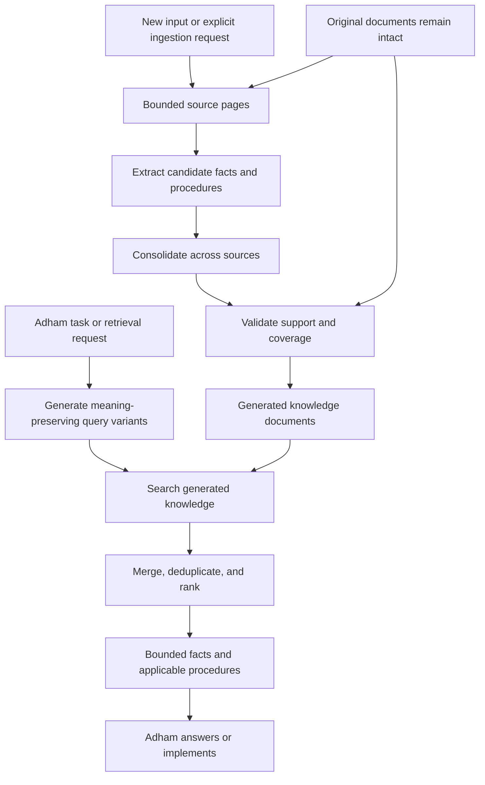

# Custom retrieval and memory for Adham

Date: 2026-10-09

Status: brainstorming and research notes. This document preserves the proposed direction, suggested safeguards, and unresolved choices. It is not an approved implementation specification. No custom ingestion or memory system has been implemented as part of this discussion.

## Motivation

Adham should work on large document collections and codebases while keeping the model's working context small. Adding Grep alone did not achieve this: the agent sometimes made broad or repeated searches and then read entire documents anyway. The existing conversation history also retains tool results, so small retrievals can accumulate across turns.

The proposed experiment goes beyond conversation summarization. A separate ingestion agent builds a curated knowledge collection ahead of time. The working agent retrieves relevant knowledge from that collection instead of repeatedly reconstructing it from original documents.

The objective is to reduce retrieved context without sacrificing accuracy, necessary detail, or adherence to applicable procedures.

## User-defined direction

- Keep the original documents intact and separate from generated knowledge.
- Run ingestion only when new data is supplied or the user explicitly requests it. Normal retrieval must not trigger ingestion automatically.
- Process sources in bounded context windows, like pagination.
- Extract self-contained information from those pages, including information distributed across multiple documents.
- Produce several searchable knowledge documents rather than one ever-growing prompt.
- Perform one or more validation iterations against the sources.
- Maintain two kinds of knowledge: facts/data and how-tos/procedures.
- Use generated knowledge as the retrieval source for suitable tasks. Direct source retrieval remains available for other cases.
- Start with grep-based retrieval over the generated knowledge documents.
- Expand a retrieval request into multiple searches using alternative terminology that preserves its original meaning.
- Merge and select results before returning a small amount of relevant knowledge to Adham.

The working agent should retrieve and follow generated how-tos rather than rely on repeatedly reading an AGENTS.md file or the original conventions documentation.

## Conceptual architecture



This is a conceptual decomposition. Whether ingestion, validation, and retrieval use distinct agents, model calls, or deterministic components remains open.

## Knowledge type 1: facts and data

Each fact should be understandable independently. Resolve references such as “he,” “this system,” or “the above rule” where the source provides enough evidence. Preserve names, dates, scope, qualifications, exceptions, and uncertainty.

Illustrative example, not actual project data:

```markdown
# Mohamed Hassan

- Mohamed Hassan joined Northwind in March 2022.
  Source: staff-directory.md, section “New hires”

- Mohamed Hassan moved from Support to Platform in June 2024.
  Source: platform-notes.md, section “Team changes”
```

The information about Mohamed might originate in several documents. Ingestion consolidates it so retrieval does not need to reconstruct the relationship every time.

Self-contained does not mean maximally shortened. Repeating the subject's name can improve retrieval and prevent ambiguity. The saving comes from retrieving a few complete facts instead of multiple original passages.

Entity identity needs evidence. Two people with the same name must not be merged automatically. Alias handling, entity resolution, and document grouping are unresolved design choices.

## Knowledge type 2: how-tos and procedures

Facts describe what is known; procedures describe how to act.

The motivating examples were:

- A model familiar with .NET 8 receives .NET 10 documentation. Ingestion extracts relevant facts and procedures for newer capabilities, which Adham retrieves while working.
- The user supplies documentation explaining repository organization. Ingestion converts the documented conventions into applicable procedures that Adham follows during implementation.

This supplements model knowledge through retrieval; it does not retrain or update model weights.

A proposed procedure structure:

```markdown
# Add an application command

Applies when:
- Adding an operation that changes application state.

Scope:
- Repository and applicable version.

Prerequisites:
- Required conditions and dependencies.

Procedure:
1. Follow the documented placement convention.
2. Implement the documented behavior.
3. Add the required validation and tests.

Completion checks:
- Observable checks that establish completion.

Exceptions:
- Documented cases requiring another approach.

Sources:
- Source document, section, and version.
```

This is a schema example, not an architectural rule for Adham or any other repository.

Procedures should be retrieved before implementation choices are made. Retrieving them only after the agent gets stuck would allow its prior habits to determine code structure first.

Separate explicit source requirements from generated suggestions. An inferred step or invented example must not silently become a user instruction. Conflicts with the current user request or between procedures must be surfaced and resolved, not hidden.

## Ingestion and pagination

Suggested processing stages:

1. Identify sources and record their versions or hashes.
2. Read bounded pages with enough structural context to interpret them.
3. Produce candidate facts and procedures with evidence references.
4. Consolidate duplicates and related information across pages and documents.
5. Validate both source support and extraction coverage.
6. Publish a consistent set of validated knowledge documents.

Extracting candidates before consolidation avoids requiring every extraction call to remember everything already processed.

Pagination needs limited carried context, such as the current heading, table headers, subject under discussion, and unresolved references. Page boundaries must not silently remove the conditions needed to interpret a statement.

The exact page budget, overlap strategy, consolidation mechanism, and stopping criteria for validation have not been chosen.

## Retrieval and query expansion

Adham sends one retrieval request. The retrieval system internally generates and executes multiple alternative searches, then returns selected knowledge rather than every raw search result.

Example:

```text
Original request: How should I add an API endpoint?

Possible variants:
- create HTTP endpoint
- add API route
- implement controller action
- register request handler
```

These are candidate ways relevant knowledge might be expressed. Their relevance depends on repository context; they are not automatically interchangeable implementation instructions.

Proposed retrieval sequence:

1. Identify intent, subject, and known scope constraints.
2. Keep the original query and generate a bounded number of variants.
3. Search the generated knowledge documents.
4. Merge and deduplicate results.
5. Rank candidates against the original request.
6. Select enough evidence and applicable procedures within a context budget.
7. Report gaps or conflicts instead of manufacturing a complete answer.

Expansion must preserve exact identifiers, versions, negation, and repository constraints. “C1” must not become “CI.” Broad words such as “decision” should not replace the distinctive subject. The earlier grep experiment also demonstrated that substring matching of “CI” can match inside “decision.”

Grep is the proposed initial matching mechanism, but it does not provide semantic understanding or relevance ranking. Query expansion, metadata, ranking, and result selection must supply those capabilities. File enumeration order is not a relevance score.

Suggested searchable metadata:

```yaml
kind: how-to
title: Add an endpoint
applies_to: repository-id
intents: [implement, review]
triggers: [endpoint, API, route, controller, HTTP handler]
```

Metadata can connect task vocabulary with procedure vocabulary. Its schema and generation process remain experimental.

## When Adham retrieves

The user identified retrieval timing as a central concern. The following was proposed, not finalized:

- At task entry, perform automatic bounded retrieval for relevant facts and procedures.
- During work, permit additional retrieval when a new subtask or specific uncertainty appears.
- Before finishing a change, check the completion criteria of procedures already retrieved, reusing them where possible.

A retrieval request could include intent (explain, implement, debug, review), subject, repository, and known framework/version. Unknown scope must not be guessed.

The motivation for automatic task-entry retrieval is that prompt-only guidance has not reliably made the working model search or stop searching appropriately.

Adham would still need a small permanent behavioral contract explaining how to use retrieved knowledge. The full conventions would live in the generated knowledge collection, not in that permanent prompt.

A proposed retrieval response:

```text
Status: supported | partial | conflicting | no match
Relevant facts: ...
Applicable procedures: ...
Missing information: ...
Sources: ...
```

These labels express retrieval assessment, not proof of correctness. A no-match result means retrieval found no support, not that the information is absent from all sources.

Direct source retrieval remains appropriate when exact wording, omitted context, unresolved contradictions, or information outside the extracted knowledge is needed. The policy for choosing between sources and generated knowledge remains open.

## Reliability measures discussed

### Evidence and provenance

Attach source location, source version/hash, and a supporting excerpt to each knowledge item. Evidence may be stored separately to keep normal retrieval small. Track whether an item is explicitly documented or inferred.

### Separate accuracy from coverage

- Accuracy validation starts from an extracted item and asks whether the source supports the entire claim, including qualifications.
- Coverage validation starts from a source page and asks which useful information was omitted.

Reviewing only generated knowledge cannot establish completeness. Repeated checking by the same model can also repeat the same error.

### Preserve conflicts, time, and scope

Do not silently resolve contradictory facts or instructions. A changed manager, for example, may represent a change over time rather than an error. Distinguish explicit supersession from unresolved disagreement.

### Validate procedures through observable checks

Where practical, compile examples, run appropriate tests, or inspect existing implementations. Record what was actually verified. Model agreement alone is weaker than an executable check.

### Control retrieval drift

Retain the original query as the relevance anchor, limit expansion, deduplicate evidence, and preserve identifiers and constraints. Do not equate multiple similar results with independent corroboration.

### Track freshness

Associate knowledge with source versions. A suggested approach is to mark affected knowledge stale when changed input is detected and replace it through an authorized ingestion run. Retrieval should not silently initiate ingestion. Source monitoring and publication details are unresolved.

### Evaluate the complete pipeline

Create known-answer tasks covering distributed facts, ambiguous identities, exceptions, conflicting or outdated procedures, alternative query wording, and unanswerable questions.

Measure:

- Answer correctness and completeness.
- Evidence support and extraction coverage.
- Retrieval misses and irrelevant results.
- Correct selection and execution of procedures.
- Context consumed, latency, and ingestion cost.
- Appropriate handling of insufficient evidence.

Compare against direct source retrieval under comparable model and context conditions. Low token usage alone is not success if relevant information disappears.

## Research reviewed

The following papers support parts of the design. The discussion reviewed their published descriptions and abstracts to identify relevance; this is not a full methodological replication or exhaustive literature review. Applications to Adham below are proposed adaptations, not claims tested by those papers.

### Dense X Retrieval: What Retrieval Granularity Should We Use?

- Publication: EMNLP 2024; initial preprint 2023.
- Paper: https://arxiv.org/abs/2312.06648
- Investigates propositions: atomic, concise, self-contained facts as retrieval units, compared with sentences and passages.
- Relevance: the closest match for the proposed extracted information lists and small independently useful retrieval units.
- Boundary: the experiments use dense retrieval. Their findings do not establish equivalent performance for grep over generated Markdown.

### RAG-Fusion: A New Take on Retrieval-Augmented Generation

- Publication: 2024.
- Paper: https://arxiv.org/abs/2402.03367
- Generates multiple queries and combines ranked retrieval results with reciprocal rank fusion.
- Relevance: the query-expansion and result-merging stages.
- Boundary: the paper reports off-topic answers when generated queries drift. Grep results would need meaningful ranking before rank-fusion techniques could be applied usefully.

### ExpeL: LLM Agents Are Experiential Learners

- Publication: AAAI 2024; initial preprint 2023.
- Paper: https://arxiv.org/abs/2308.10144
- Extracts natural-language insights from task experiences and recalls insights and experiences during later tasks without updating model weights.
- Relevance: using external knowledge to influence future agent actions, especially procedural guidance.
- Boundary: ExpeL learns from experiences. Producing procedures from user-supplied documentation is an adaptation, not the same ingestion process.

### Chain of Natural Language Inference for Reducing Large Language Model Ungrounded Hallucinations

- Publication: 2023 preprint.
- Paper: https://arxiv.org/abs/2310.03951
- Uses a hierarchical natural-language inference approach to detect unsupported generated content and reduce it through post-editing.
- Relevance: checking extracted facts and instructions against their source evidence.
- Boundary: checking support does not establish that extraction captured all relevant source information.

### RAPTOR: Recursive Abstractive Processing for Tree-Organized Retrieval

- Publication: ICLR 2024.
- Paper: https://arxiv.org/abs/2401.18059
- Recursively clusters and summarizes text to build a retrieval hierarchy with different levels of abstraction.
- Relevance: organizing a large generated knowledge collection into detailed and overview representations.
- Boundary: a summary hierarchy is not equivalent to validated atomic facts or executable procedures.

### From Local to Global: A Graph RAG Approach to Query-Focused Summarization

- Initial preprint: 2024.
- Paper: https://arxiv.org/abs/2404.16130
- Extracts entities and relationships and produces community summaries for answering questions over document collections.
- Relevance: consolidating information distributed across sources, such as the Mohamed example.
- Boundary: its graph and global summarization approach is more extensive than the proposed initial grep-based version. Entity consolidation ideas can be explored without adopting the full architecture.

### Chain-of-Verification Reduces Hallucination in Large Language Models

- Initial preprint: 2023; ACL Findings 2024.
- Paper: https://arxiv.org/abs/2309.11495
- Separates drafting, verification-question planning, independently answering those questions, and revising the response.
- Relevance: structuring validation to reduce the influence of the initial draft on later checks.
- Boundary: for this project, checks should use original source evidence. Self-verification alone does not prove accuracy or completeness.

Suggested initial reading order: Dense X Retrieval, RAG-Fusion, CoNLI, then ExpeL. RAPTOR and GraphRAG offer additional organization strategies if the initial collection grows beyond simple files.

None of these papers alone validates the full proposed combination of bounded document ingestion, separate facts and how-tos, grep-based multi-query retrieval, and a local coding agent.

## Candidate first experiment

This is a suggested experiment, not an implementation commitment:

1. Select a small document collection containing distributed facts and explicit procedures.
2. Prepare evaluation questions and implementation tasks before tuning ingestion or retrieval.
3. Generate evidence-backed facts and procedures using bounded pages.
4. Run separate support and coverage validation passes.
5. Compare direct source retrieval with retrieval over the generated collection.
6. Compare a single query with expanded queries, holding the returned context budget comparable.
7. Evaluate whether retrieved procedures change implementation behavior correctly.
8. Inspect failures before adding graph storage, embeddings, more agents, or additional validation iterations.

## Open decisions

- Does ingestion discover entities/topics automatically, or receive extraction targets?
- How should facts and procedures be grouped into documents?
- What metadata and evidence schemas should be used?
- How are page boundaries, tables, and unresolved references handled?
- How are identity, aliases, contradictions, and superseded instructions represented?
- What validates a how-to strongly enough to publish it?
- How many query variants are useful, and how is query drift detected?
- How are grep matches ranked, merged, and selected within the budget?
- When is direct source retrieval appropriate, and how does Adham make that decision?
- How are task-entry retrieval and later retrieval integrated into the agent loop?
- How are source changes detected without introducing unauthorized ingestion?
- Which context budget, latency target, and task mix define a successful experiment?
- How much evidence should be retained in conversation after the current task?

The initial direction remains a separate, validated retrieval collection containing factual and procedural knowledge, with event-driven ingestion and bounded multi-query retrieval during work.
